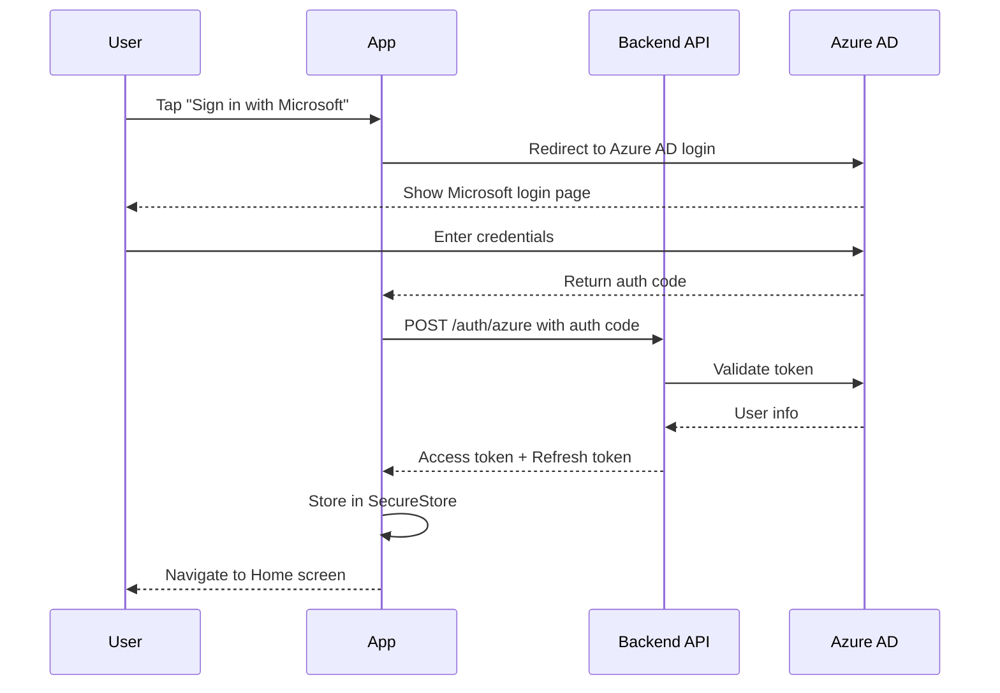
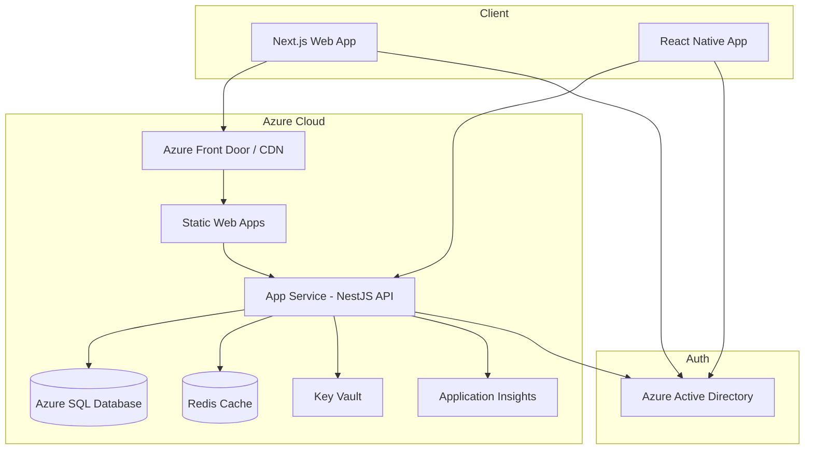
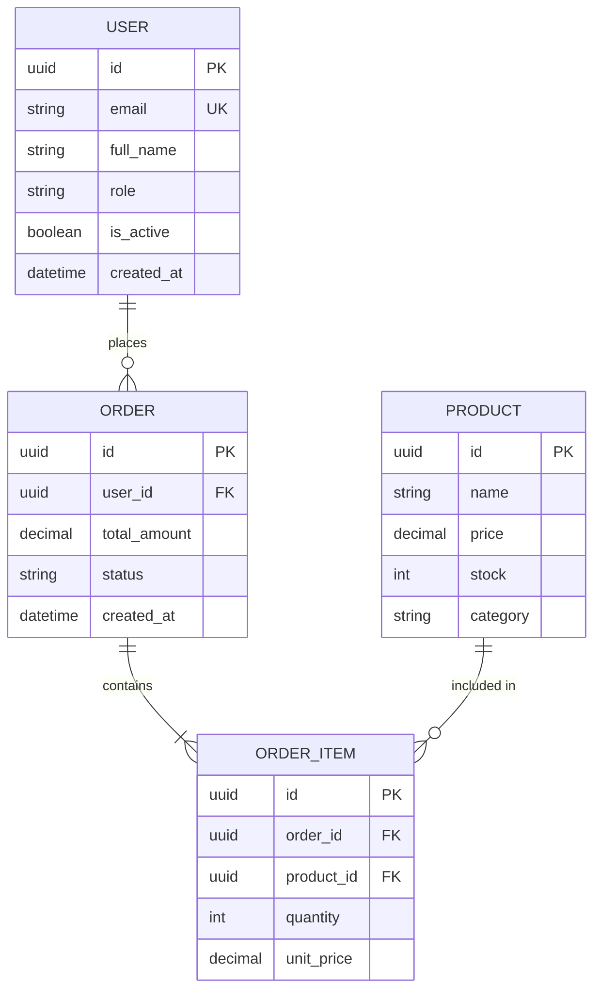

# /diagram Command

## Description
Generates Mermaid diagrams from your code — architecture, data flow, database ERD, component tree, API flow, and more. Renders inline in GitHub, VS Code, and Notion.

## Usage
```
/diagram architecture       → System architecture overview
/diagram flow [feature]     → User/data flow for a feature
/diagram erd                → Database entity relationship diagram from schema
/diagram components         → React component tree
/diagram api [endpoint]     → API request/response sequence diagram
/diagram auth               → Authentication flow diagram
/diagram ci                 → CI/CD pipeline diagram
```

## Examples
```
/diagram auth
/diagram erd
/diagram flow checkout process
/diagram architecture
```

## Output Examples

### Authentication Flow


### System Architecture


### Database ERD


## Where to use Mermaid diagrams
- GitHub PRs and READMEs (native rendering)
- VS Code (Markdown Preview Mermaid Support extension)
- Notion pages
- Confluence (Mermaid plugin)
- Storybook documentation

## See Also
- `commands/pr-description.md` — Include diagrams in PR descriptions
- `agents/devops.md` — Architecture planning
