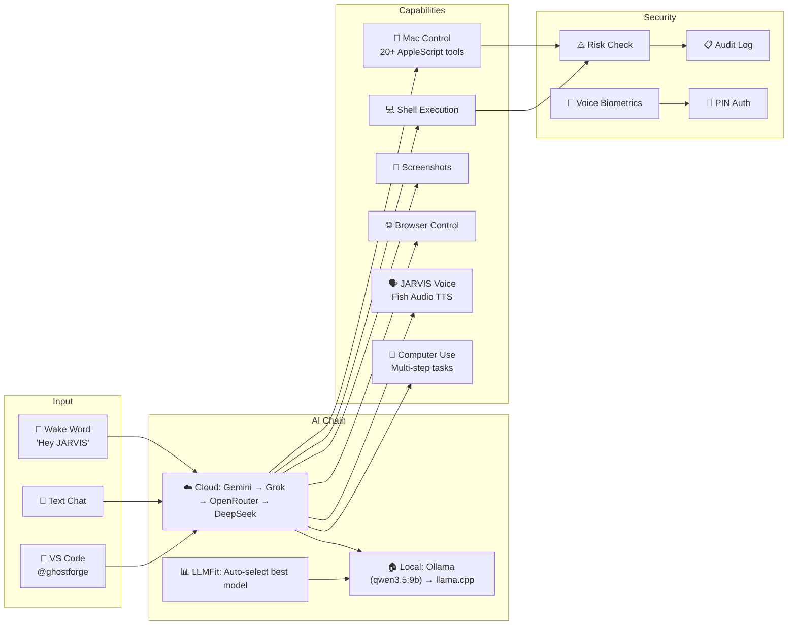

# 👻 GhostForge — Complete Project Analysis

> **Version:** 5.1.0 · **Author:** Hisham Abulfeilat · **License:** MIT
> *"Operator-grade dev tools, forged in the shadows."*

## What is GhostForge?

GhostForge is a **comprehensive AI-powered developer toolkit** that supercharges GitHub Copilot (and other AI coding assistants) with deep domain knowledge. It's designed as a full-stack "JARVIS for developers" — a personal AI assistant that can:

- **Control your Mac** (AppleScript, screenshots, browser control)
- **Chat with multiple AI models** (Gemini, Grok, OpenRouter, Ollama, DeepSeek)
- **Run 70+ developer commands** from a beautiful TUI, Web UI, or VS Code extension
- **Manage projects** end-to-end (create, health-check, deploy, test, security audit)
- **Speak with a JARVIS voice** (Fish Audio clone with wake-word detection)

It's not just one tool — it's an **entire platform** with 5 access interfaces, 14 specialized agents, and 250+ files.

---

## Architecture Overview

```mermaid
graph TB
    subgraph "Access Interfaces"
        TUI["🖥 Terminal UI<br/>Node.js + Ink/Blessed"]
        WebUI["🌐 Web UI<br/>Next.js 15 + React 18"]
        VSCode["📦 VS Code Extension<br/>TypeScript + esbuild"]
        CLI["⌨️ CLI<br/>Bash launcher"]
        Copilot["🤖 @ghostforge<br/>Copilot Extension"]
    end

    subgraph "Core Engine"
        Scripts["📜 76 Shell Scripts<br/>Bash"]
        Commands["📖 94 Command Docs<br/>Markdown"]
        Agents["🤖 14 Agent Roles<br/>Markdown prompts"]
        MCP["🔌 MCP Server<br/>Node.js"]
    end

    subgraph "AI Layer (G.F.A.I.)"
        Gemini["Gemini 2.5 Pro"]
        Grok["Grok (xAI)"]
        OpenRouter["OpenRouter"]
        Ollama["Ollama Local"]
        DeepSeek["DeepSeek V4"]
        LLMFit["LLMFit Scorer"]
    end

    subgraph "Knowledge"
        Instructions["📚 24 Instructions"]
        Prompts["📝 7 Prompt Templates"]
        Snippets["📋 21 Code Snippets"]
        Knowledge["🧠 6 Knowledge Docs"]
        Marketplace["🛒 28-item Marketplace"]
    end

    subgraph "Infrastructure"
        Bridge["🌉 Mac Bridge<br/>WebSocket :4747"]
        Terminal["💻 ttyd Terminal<br/>:4748"]
        Tunnel["☁️ Cloudflare Tunnel"]
        Auth["🔒 PIN Auth + Biometrics"]
    end

    TUI --> Scripts
    WebUI --> Scripts
    VSCode --> Scripts
    CLI --> Scripts
    Copilot --> MCP
    
    WebUI --> Bridge
    Bridge --> Terminal
    Tunnel --> WebUI
    
    Scripts --> Agents
    Scripts --> Commands
    
    WebUI --> Gemini
    WebUI --> Grok
    WebUI --> OpenRouter
    WebUI --> Ollama
    WebUI --> DeepSeek
    LLMFit --> Ollama
```

---

## Directory Structure & Components

### 1. 🖥 Terminal UI (`tui/`)
| File | Size | Purpose |
|------|------|---------|
| [index.js](file:///Users/you/ghostforge/tui/index.js) | 326 KB | Main TUI application — **massive** single-file interactive dashboard |
| [dashboard.js](file:///Users/you/ghostforge/tui/dashboard.js) | 18 KB | Real-time developer dashboard (tickets, CI, health charts) |
| [package.json](file:///Users/you/ghostforge/tui/package.json) | — | Deps: `inquirer`, `blessed`, `blessed-contrib`, `chalk`, `figlet`, `ora` |

**Tech:** Node.js 18+, ESM modules, Blessed for rich terminal rendering, Inquirer for interactive prompts.

25+ TUI screens including: Developer Dashboard, Project Health, Command Runner (fuzzy search), Agent Switcher, Snippet Browser, Bundle Analyzer, RTL Audit, Marketplace, and more.

---

### 2. 🌐 Web UI (`web-ui/`)
A **Next.js 15** web application with 16+ pages, accessible from any device on LAN or globally via Cloudflare Tunnel.

**Key pages:**

| Route | Component |
|-------|-----------|
| `/jarvis` | JARVIS AI assistant (voice + tools + memory) |
| `/chat` | AI Chat (Gemini 2.5 Pro, Copilot Suggest mode) |
| `/dashboard` | Live project dashboard |
| `/terminal` | Full xterm.js web terminal |
| `/features` | 24 command cards across 6 categories |
| `/marketplace` | Browse/install plugins |
| `/settings` | Live AI model switcher |
| `/remote` | WebRTC + noVNC remote control |
| `/mac-control` | Mac automation controls |
| `/models` | Browse, install, switch Ollama models |
| `/login` | PIN-based authentication |
| `/orchestrate` | Multi-model orchestration |
| `/automation` | Automation workflows |
| `/files` | File browser |
| `/history` | Chat history |

**18 API routes** including: `/api/jarvis`, `/api/chat`, `/api/execute`, `/api/mac-control`, `/api/models`, `/api/dashboard`, `/api/auth`, `/api/llmfit`, `/api/remote`, etc.

**14 React components** including: `ChatInterface`, `CommandPalette`, `XTermWrapper`, `OrchestratePanel`, `NotificationCenter`, `LLMfitAutoSwitch`, `MacMetricsWidget`, `PWAInstallBanner`.

**Key libraries:** `@ai-sdk/google`, `@ai-sdk/deepseek`, `@ai-sdk/openai`, `@monaco-editor/react`, `@xterm/xterm`, `lucide-react`, `novnc-next`, `zod`, `socket.io-client`, `tailwindcss`.

---

### 3. 📦 VS Code Extension (`extension/`)
A local VS Code extension (v2.8.0) written in **TypeScript + esbuild**.

**Features:**
- Command Picker (`Cmd+Shift+E`)
- `@ghostforge` Copilot Chat participant
- Snippet sidebar with click-to-insert
- Commands sidebar by category
- Right-click context menus (health, RTL, bundle, storybook)
- Status bar quick access
- Pre-built `.vsix` packages for easy install

---

### 4. 📜 Scripts (`scripts/`) — 76 files
The **engine room** — all functionality is implemented as Bash scripts that are called by every interface.

**Categories:**

| Category | Scripts |
|----------|---------|
| **Project** | `create-project.sh`, `open-project.sh`, `copy-to-project.sh`, `init-config.sh` |
| **Health** | `health-check.sh`, `health-score.sh`, `doctor.sh`, `dep-health.sh` |
| **AI** | `bridge.sh` (Mac bridge), `gemini.sh`, `voice.sh`, `free-models.sh`, `skills.sh` |
| **Git** | `changelog.sh`, `git-hooks.sh`, `git-autopilot.sh`, `release.sh` |
| **Security** | `security-check.sh`, `pentest.sh` (27 KB!), `setup-https.sh` |
| **Testing** | `coverage.sh`, `storybook.sh`, `test-all-features.sh`, `lighthouse.sh` |
| **Code Quality** | `carbon.sh` (71 KB — green coding!), `rtl.sh`, `bundle.sh`, `unused.sh` |
| **DevOps** | `deploy-azure.sh`, `tunnel.sh`, `docker-gen.sh`, `build-android.sh`, `build-ios.sh` |
| **Career** | `career-cv.sh`, `career-prep.sh`, `career-track.sh`, `career-gap.sh`, `career-linkedin.sh` |
| **Docs** | `api-docs.sh`, `api-types.sh`, `explain.sh`, `daily-digest.sh`, `update-readme-routes.js` |
| **Generators** | `component-gen.sh`, `generate.sh`, `figma-tokens.sh`, `graphql-sync.sh`, `schema-viz.sh` |
| **System** | `setup-env.sh`, `env-check.sh`, `env-manager.sh`, `update.sh`, `marketplace.sh` |

> [!NOTE]
> `carbon.sh` (71 KB) is a particularly ambitious script — a full **green coding / carbon footprint tracker** for projects.

---

### 5. 📖 Commands (`commands/`) — 94 Markdown files
Each `.md` file is a **command definition** that describes a slash command's behavior, parameters, and example output. These are read by Copilot, the TUI, and the extension to understand what each command does.

Examples: `/health`, `/security`, `/review`, `/deploy`, `/scaffold`, `/pentest`, `/sql`, `/mock`, `/i18n`, `/storybook`, `/commit`, `/pr-description`, `/free-models`, `/autopilot`, `/carbon`, `/career-cv`, `/career-prep`, and many more.

---

### 6. 🤖 Agents (`agents/`) — 14 specialized roles
Each agent is a Markdown file defining a **persona with deep domain expertise**:

| Agent | Domain |
|-------|--------|
| `frontend-web.md` | React/Next.js/TypeScript/Tailwind |
| `backend-cms.md` | Backend & CMS (Sitecore, Sitefinity) |
| `mobile.md` | React Native / mobile development |
| `architect.md` | System architecture & design |
| `devops.md` | CI/CD, Docker, Azure |
| `qa.md` | Testing & QA |
| `security.md` | Security auditing & pentesting |
| `sql-etl.md` | SQL, ETL, data reporting |
| `ai-integration.md` | AI/ML integration |
| `data-viz.md` | Data visualization |
| `ui-ux.md` | UI/UX design |
| `fullstack.md` | Full-stack development |
| `backend.md` | Backend API development |
| `ticket-checker.md` | Ticket/issue management |

---

### 7. 🔌 MCP Server (`mcp/`)
A **Model Context Protocol** server that exposes GhostForge tools as MCP tools for AI assistants:

- `health_check(projectPath)` — run project health scan
- `get_tickets(provider, repo, owner)` — fetch GitHub/Azure/Jira tickets
- `fix_ticket(provider, repo, owner, issueNumber)` — auto-fix a ticket
- `list_models(tier?)` — list available AI models
- `get_best_model(taskType)` — LLMFit recommendation
- `security_scan(projectPath)` — run security audit
- `list_snippets()` / `get_snippet(name)` — browse code snippets

---

### 8. 🛒 Marketplace (`marketplace/`)
A plugin/extension ecosystem:

| File | Purpose |
|------|---------|
| `catalog.json` | 28-item marketplace catalog |
| `sources.json` (35 KB) | Curated sources for plugins, skills, tools |
| `custom-models.json` | Custom AI model configurations |
| `registry.json` | Installed items tracking |
| `custom-agents/` | User-created agents |
| `custom-commands/` | User-created commands |

---

### 9. 📚 Instructions (`instructions/`) — 24 files
Deep technical instruction packs that Copilot reads for domain expertise:

`api-design`, `arabic-rtl`, `azure`, `docker`, `error-handling`, `figma`, `free-models`, `general-knowledge`, `ghostforge-config`, `git-workflow`, `model-selection`, `monorepo`, `nextjs`, `react-doctor`, `react-native`, `react-patterns`, `react-web`, `sitecore`, `sitefinity`, `sql-reporting`, `state-management`, `tailwind`, `testing-strategy`, `typescript`

---

### 10. Supporting Components

| Directory | Contents | Count |
|-----------|----------|-------|
| **prompts/** | Prompt templates (add-feature, create-project, deploy, optimize, qa-test, security-review, sql-report) | 7 |
| **snippets/** | Production-ready code patterns (TanStack Table, MSAL Auth, Zustand, React Hook Form + Zod, etc.) | 21 |
| **knowledge/** | Team knowledge base (decisions, environments, gotchas, onboarding, patterns) | 6 |
| **templates/** | Project starters (react-vite, nextjs-i18n) | 2 |
| **bin/** | Binary helpers | 2 |

---

## G.F.A.I. — The JARVIS System

The crown jewel of GhostForge is **G.F.A.I. (GhostForge Artificial Intelligence)** — a JARVIS-style AI assistant:



**Key features:**
- **SSE Streaming** — AI response acknowledged within ~50ms
- **Offline mode** — Works fully locally with Ollama + llama.cpp
- **Cross-device** — One Mac host, accessed from any device (including Android/iOS)
- **20+ Mac control tools** — click, type, scroll, open apps, send messages, lock screen
- **Computer-use** — execute_code, task_steps, describe_screen
- **Voice biometrics** — Resemblyzer speaker verification to lock out imposters

---

## Tech Stack Summary

| Layer | Technology |
|-------|-----------|
| **CLI/TUI** | Node.js 18+, Bash, Blessed, Inquirer, Chalk, Figlet |
| **Web UI** | Next.js 15, React 18, TypeScript, Tailwind CSS, xterm.js, Monaco Editor |
| **VS Code Extension** | TypeScript, esbuild, VS Code Extension API |
| **AI SDK** | Vercel AI SDK (`ai`), `@ai-sdk/google`, `@ai-sdk/openai`, `@ai-sdk/deepseek` |
| **AI Models** | Gemini 2.5 Pro, Grok, OpenRouter (Gemma, Nemotron, DeepSeek), Ollama, llama.cpp |
| **Voice** | Fish Audio TTS, Web Speech API, Resemblyzer biometrics |
| **Networking** | WebSocket bridge, SSE streaming, Cloudflare Tunnel, noVNC |
| **Security** | PIN auth, regex blocklist, audit logging, voice biometrics, risk confirmation |
| **MCP** | Model Context Protocol server for Copilot integration |

---

## File Statistics

| Component | Files | Notes |
|-----------|-------|-------|
| Scripts | 76 | Bash (+ 2 Node.js helpers) |
| Commands | 94 | Markdown command definitions |
| Instructions | 24 | Domain expertise packs |
| Snippets | 21 | Production-ready code patterns |
| Agents | 14 | Specialized AI personas |
| Prompts | 7 | Prompt templates |
| Knowledge | 6 | Team knowledge base |
| Web UI pages | 16+ | Next.js routes |
| Web UI API routes | 18 | Next.js API handlers |
| Web UI components | 14 | React components |
| Web UI libraries | 14 | Shared utilities |
| **Total** | **250+** | Full-stack toolkit |

---

## How It All Connects

1. **User** picks an interface: TUI, Web UI, VS Code, CLI, or Copilot Chat
2. **Interface** routes to the appropriate **Bash script** in `scripts/`
3. **Scripts** read **command definitions** from `commands/` and **instructions** from `instructions/`
4. **AI requests** go through the **model chain**: Cloud providers → Ollama → llama.cpp
5. **Mac bridge** (WebSocket on `:4747`) enables remote command execution
6. **Security layer** blocks dangerous commands, logs everything, and optionally verifies voice identity
7. **Results** are rendered in the chosen interface with full formatting

> [!TIP]
> The fastest way to experience GhostForge is: `~/ghostforge/ghostforge` (launches the TUI) or start the Web UI with `cd ~/ghostforge/web-ui && npm run dev`.
